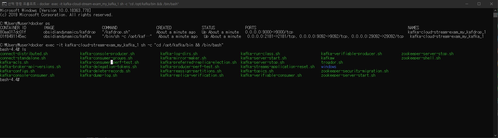
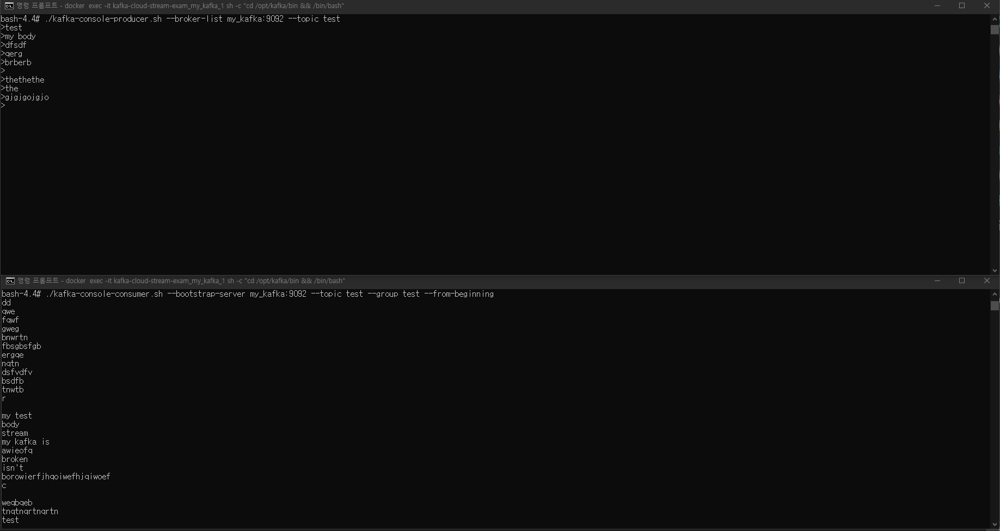
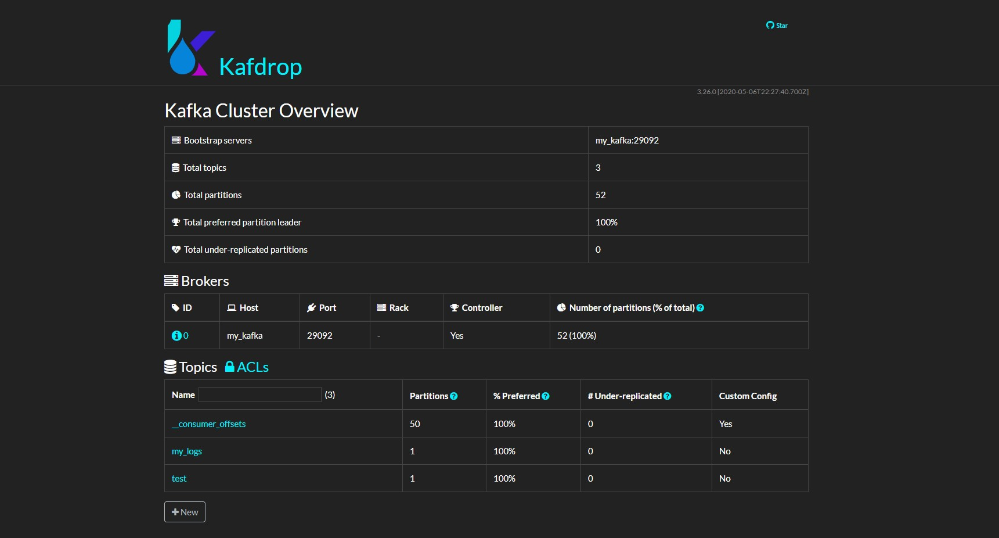
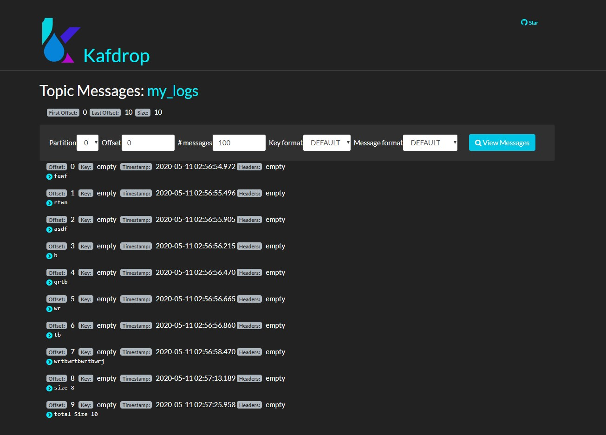

## kafdrop Run

    docker-compose -f docker-compose-kafdrop.yml up -d
    
    docker-compose -f docker-compose-kafdrop.yml ps
    
> localhost:9000 in your browser
>
> another cmd

    docker exec -it kafka-cloud-stream-exam_my_kafka_1 sh -c "cd /opt/kafka/bin && /bin/bash"
    

    
    ./kafka-console-producer.sh --broker-list my_kafka:9092 --topic test
    
> another cmd

    ./kafka-console-consumer.sh --bootstrap-server my_kafka:9092 --topic test --group test --from-beginning
    

> another cmd

    ./kafka-console-producer.sh --broker-list my_kafka:9092 --topic my_logs

> another cmd

    ./kafka-console-consumer.sh --bootstrap-server my_kafka:9092 --topic my_logs --group my_logs --from-beginning
    

### Add topic my_logs

